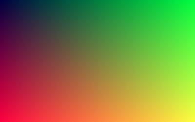
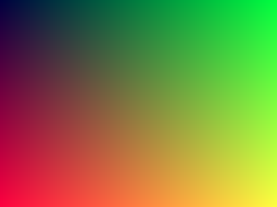
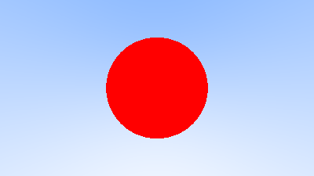

# Ray Tracing in One Weekend

### Chapter 01 Gradient Color

### Chapter 02 Refactoring code above with `Vec3` and `Color`

### Chapter 03 Rays, Simple Camera, Background

### Chapter 04 Ray-Sphere Intersection

